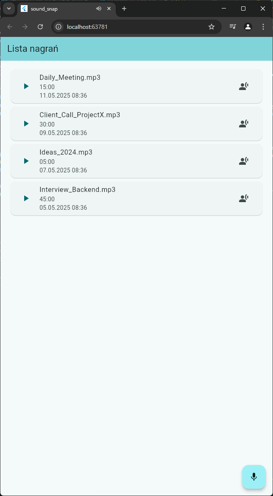
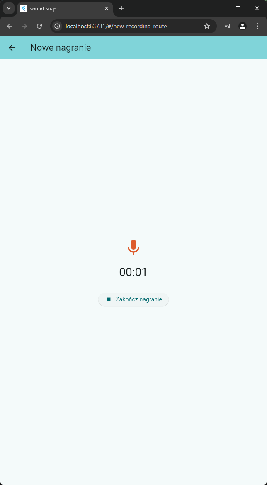
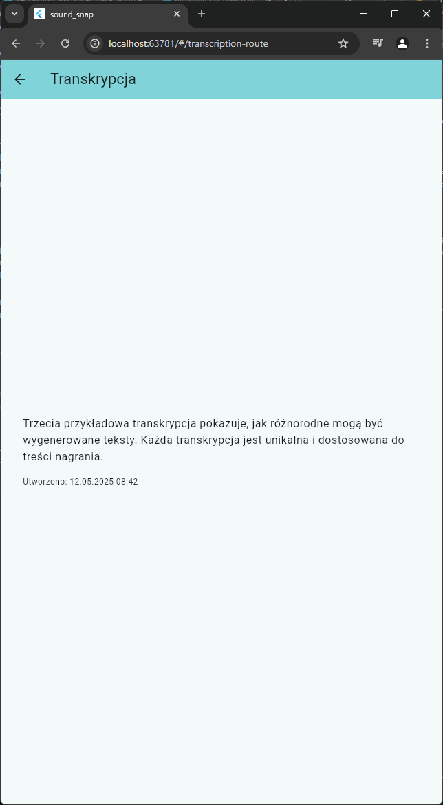

# Sound Snap

A demo Flutter application showcasing audio recording, playback, and transcription features with mock implementations.

## 🎯 Overview

Sound Snap is a demonstration project that implements a mock audio management system. It's designed to showcase:
- Basic audio recording functionality
- Audio playback with mock files
- Mock transcription service
- State management patterns

## 🛠️ Technologies

### Core Technologies
- **Flutter** - UI framework
- **FVM** - Flutter Version Management
- **Bloc/Cubit** - State management
- **Freezed** - Code generation for immutable models
- **Injectable** - Dependency injection
- **Just Audio** - Audio playback
- **Loggy** - Logging system

### Architecture
- Clean Architecture
- Feature-first structure

## 📸 Screenshots

  
  
  

## ⚠️ Important Note

This is a demonstration project with mock implementations. The following features are simulated:
- Audio recording (uses mock files)
- Audio playback (uses sample audio files)
- Transcription (returns mock text)

The application has been tested on:
- Web (Chrome)

